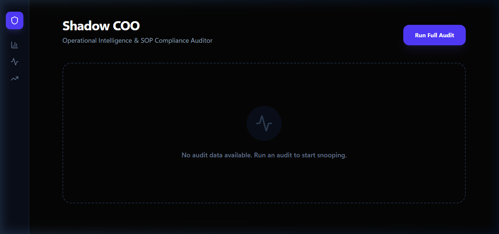
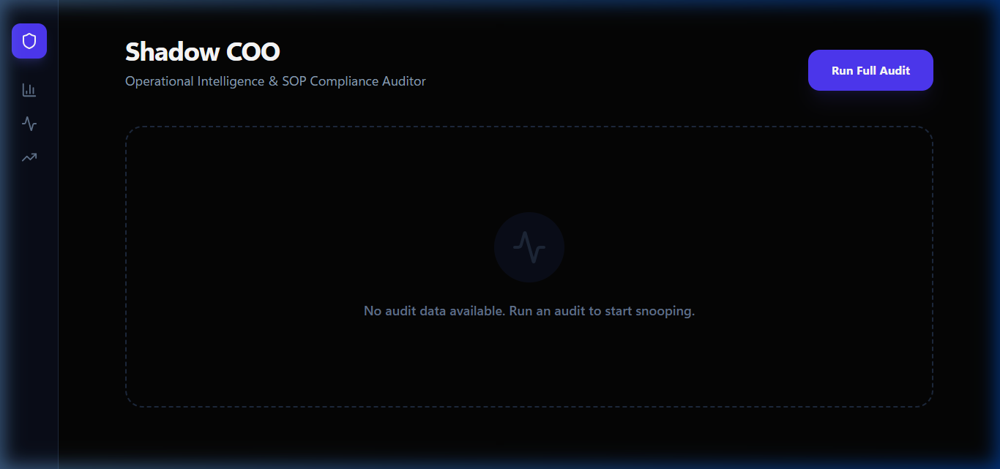
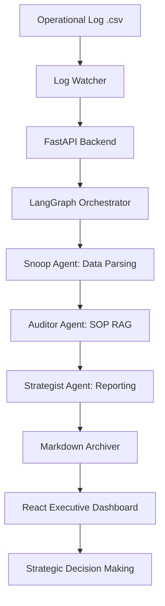

<div align="center">

# 🕵️‍♂️ SHADOW

### Autonomous Operational Auditor — Business Intelligence & SOP Compliance with Local AI

[](https://www.python.org/)
[](https://fastapi.tiangolo.com/)
[](https://pandas.pydata.org/)
[](https://react.dev/)
[](https://langchain.com/langgraph)
[](LICENSE)

<br/>

> **SHADOW** is an AI-powered operations auditor that monitors your business performance against your Standard Operating Procedures (SOPs). It "snoops" on daily operational logs, cross-references them with indexed business rules using local Qwen 2.5 7B models, and generates strategic executive reports to ensure operational excellence—100% locally and privately.

<br/>

   

</div>

---

## 📋 Table of Contents

- [Overview](#-overview)
- [Application Preview](#-application-preview)
- [Features](#-features)
- [Architecture](#-architecture)
- [Tech Stack](#-tech-stack)
- [Project Structure](#-project-structure)
- [Installation](#-installation)
- [Usage](#-usage)
- [API Reference](#-api-reference)
- [Configuration](#-configuration)
- [Design Decisions](#-design-decisions)
- [License](#-license)

---

## 🧠 Overview

**SHADOW** acts as an autonomous Chief Operating Officer. It bridges the gap between static business rules (SOPs) and dynamic daily activities (Task Logs).

In a high-stakes environment like catering, logistics, or healthcare, missed steps lead to failures. SHADOW ensures:
- **Order Integrity:** Are orders confirmed on time?
- **Safety Compliance:** Are temperature checks and storage rules followed?
- **Strategic Growth:** What are the top 3 things we should fix this week?

---

## 🖼️ Application Preview

<div align="center">

### 1) Executive Dashboard
*A high-level view of operational health and active violations.*



<br/>

### 2) Intelligence Briefing
*The AI Strategist's weekly report with actionable efficiency tips.*



</div>

---

## ✨ Features

| Feature | Description |
|---|---|
| 🔍 **Autonomous Auditing** | Automatically cross-references CSV task logs against Markdown SOPs. |
| 📊 **Operational Health Score** | Real-time calculation of business compliance (0-100%). |
| 👁️ **Live Log Monitor** | Watches your `data/logs/` folder and triggers audits instantly on file save. |
| 📜 **Persistent Archiving** | Every audit is saved as a timestamped Markdown report in `data/reports/`. |
| 🤖 **Multi-Agent Brain** | Specialized agents for Snoop (Parsing), Auditor (Rules), and Strategist (Reporting). |
| 🎨 **Premium Glassmorphism UI** | Modern dark-mode dashboard built with Tailwind CSS v4 and Framer Motion. |

---

## 🏗️ Architecture



---

## 🛠️ Tech Stack

| Layer | Technology |
|---|---|
| **Orchestration** | LangGraph, LangChain |
| **Analysis** | Local Qwen 2.5 7B (via llama.cpp) |
| **Data Processing** | Pandas, Pydantic |
| **Vector DB** | ChromaDB (SOP Indexing) |
| **Backend** | FastAPI, Uvicorn, Watchdog |
| **Frontend** | React 18, Vite, Tailwind CSS v4 |
| **Animations** | Framer Motion, Lucide Icons |

---

## 📁 Project Structure

```
shadow-coo-operations-auditor/
│
├── backend/
│   ├── agents/
│   │   ├── graph.py           # LangGraph workflow
│   │   └── nodes.py           # Snoop/Auditor/Strategist logic
│   ├── utils/
│   │   ├── rag.py             # SOP RAG Manager
│   │   └── watcher.py         # Automated Log Watcher
│   ├── main.py                # FastAPI entry point
│   └── requirements.txt
│
├── data/
│   ├── sops/                  # Business Rules (Markdown)
│   ├── logs/                  # Daily Activity (CSV)
│   └── reports/               # Archived Executive Reports
│
├── frontend/
│   ├── src/
│   │   ├── App.jsx            # Executive Dashboard
│   │   └── index.css          # Tailwind v4 styles
│   └── vite.config.js
│
└── README.md
```

---

## 🚀 Installation

### 1) Start the AI Brain
Run your local `llama.cpp` server (Port 8080):
```bash
llama-server -m "./models/qwen2.5-7b-q5.gguf" --port 8080 -ngl 0 -t 4 -c 4096
```

### 2) Backend Setup
```bash
cd backend
python -m venv venv
venv\Scripts\activate
pip install -r requirements.txt
python main.py
```

### 3) Frontend Setup
```bash
cd frontend
npm install
npm run dev
```

---

## 💻 Usage

1. **Define your rules:** Place your `.md` SOPs in `data/sops/`.
2. **Log your work:** Update your `daily_ops.csv` in `data/logs/`.
3. **Automated Audit:** Watch the "SHADOW" backend trigger an audit instantly.
4. **Review:** Open the dashboard to see your Health Score and the Strategist's report.
5. **History:** Check `data/reports/` for the permanent audit trail.

---

## 📡 API Reference

| Method | Endpoint | Description |
|---|---|---|
| `GET` | `/audit` | Trigger a manual full operational audit |
| `GET` | `/history` | Fetch a list of all archived executive reports |
| `GET` | `/status` | Check health of the watcher and LLM connection |

---

## ⚙️ Configuration

`backend/.env`:
```bash
LLM_BASE_URL=http://localhost:8080/v1
CHROMA_DB_PATH=./chroma_db
SOP_PATH=../data/sops
LOG_PATH=../data/logs
REPORT_PATH=../data/reports
```

---

## License

This project is licensed under the MIT License. See [LICENSE](./LICENSE).

<div align="center">
Built by Telvin Crasta · Operational Intelligence · Production-ready
<br/>
⭐ If SHADOW helped you optimize your business, star the repo.
</div>
